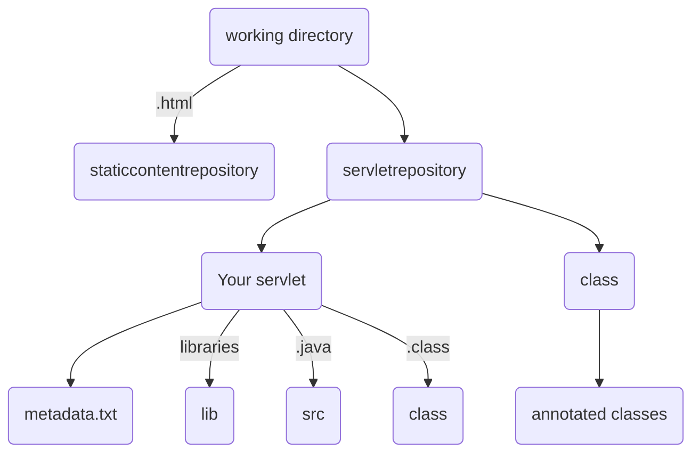

# TPBSCA
My implementation of a Thread Pool Based Servlet Container with Annotations for the Software Platforms project

- Requires Java 8 to work properly
- Supports static and dynamic contents
- Everything is managed through a CLI 


1) Compile java files
```bash
javac -cp javax/javax.servlet-api-3.1.0.jar:. *.java
```
Remember to replace ':' with ';' if you're using Windows

2) Create the jar 
```bash
jar -cfm tpbsca.jar Manifest.txt .
```
3) Run the jar
```bash
java -jar tpbsca.jar
```
## Supported Commands
| Command | Description |
| --- | --- |
| load [servlet]| Load a servlet using metadata.txt file |
| remove [servlet] | Unload a servlet |
| load-with-annotations [servlet] | Load a servlet using annotations instead of metadata.txt | 
| ls | Display running servlets |
| mt | Display the handler.txt file that shows which thread handled the n-th request associated to its date and time |
| quit | Exit the program |

## Example of usage
1. load myservlet
2. Open your browser and go to http://localhost:7654/servlet/myservlet
3. You should see letters of the english alphabet displayed with a certain delay


## Create your own
If you want to create servlets by yourself, you have to follow this structure

